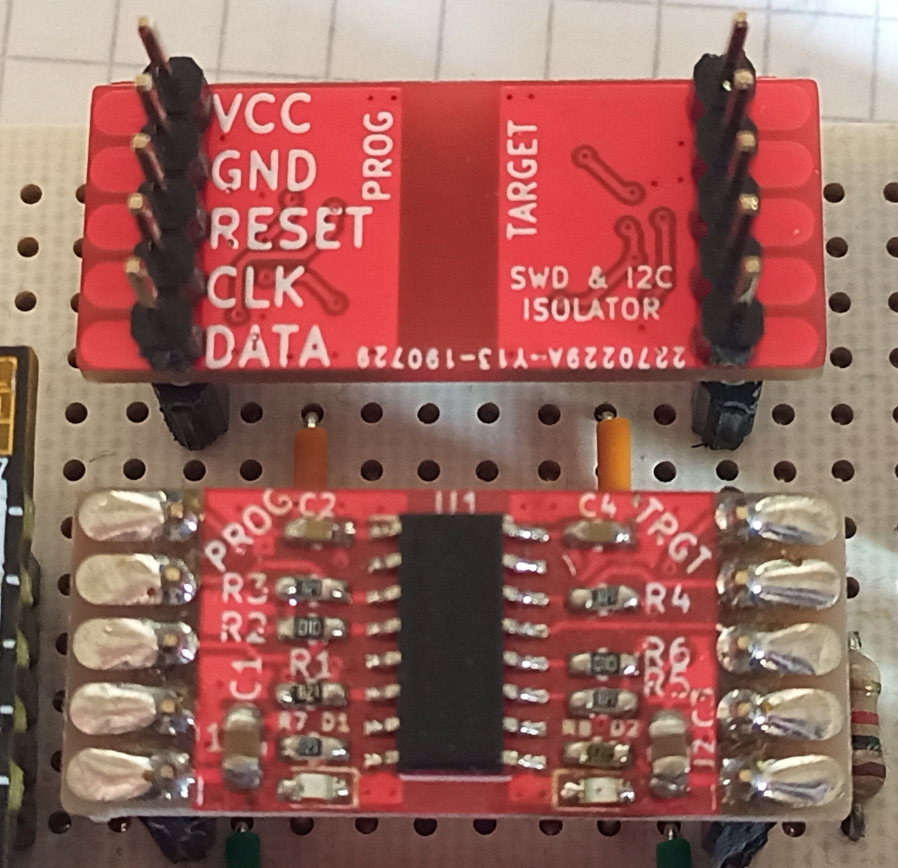

# SWD_Isolator
Generic isolator for SWD, I2C, UART, ...

#### PCB vie

#### Finished product

#### Schematic

## Description
This is a quick'n'dirty isolator, that was used for SWD programming & I2C comms, with PSoC microcontrollers.
It solves a very "sparky" situation, of connecting a mains earthed computer, to a device that does not have an earth (PE) connection. Because devices without a PE connections can be elevated by 1/2 mains voltage (so 115V in 230V systems), there is a real chance of zapping devices that get connected to it. This adapter solves that particular issue.

The chip has 2x open-drain bidirectional pins, making it suitable for a range of protocols. SWD, I2C and UART have all been tested.
There are also two unidirectional pins (one to each side), but only one is used (as RESET) in programming.

The schematic calls for 3k resistors on bi-directional lines. In practice 820R resistors were used without issues, with good rising edges & high (couple of MHz) frequencies.

## Files
* The Gerber files are in the HW/Gerbers directory
* The BOM is in the HW/ibom directory
* The schematic is here in the root directory